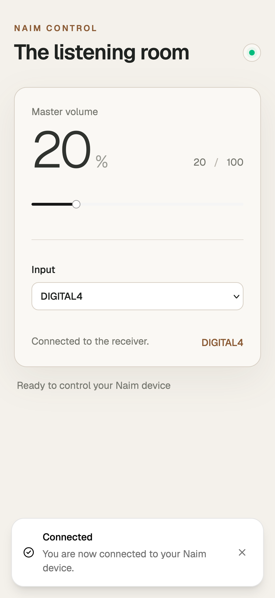
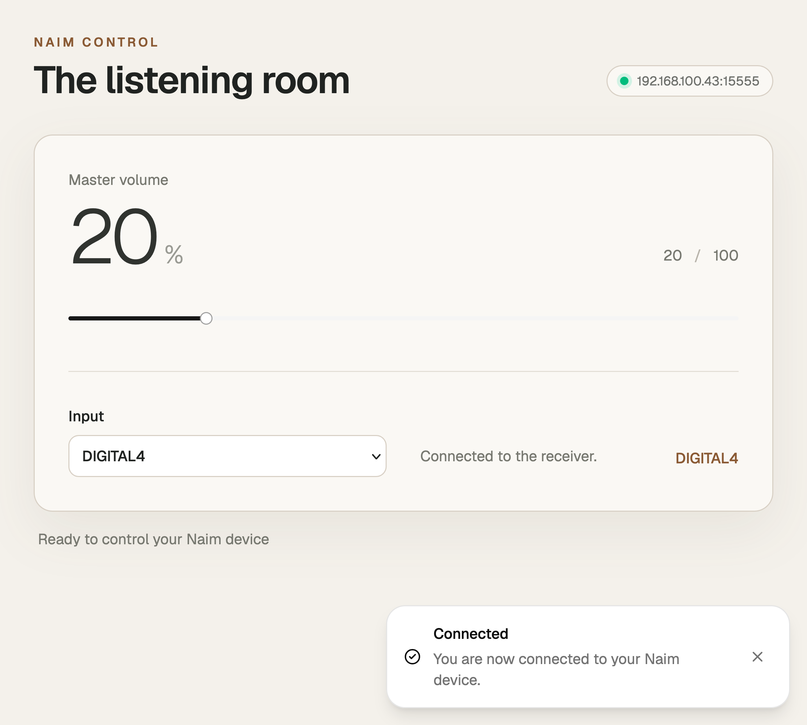

# Naim Control Web Interface

Naim Control is a web application for controlling the Naim Qute-01CC amplifier
from a phone, iPad, or desktop. It displays the amplifier connection status and
provides controls for volume and audio input selection.

## How it works

The frontend runs in the browser and provides the responsive control interface.
It connects to the Rust backend over WebSocket for real-time updates and user
actions. The backend maintains the connection to the Naim Qute-01CC over TCP,
using the [`naim-client`](https://github.com/69Nesta/naim-client) Rust library.
It translates browser commands into amplifier commands and broadcasts the
latest device state back to connected clients.

The amplifier address and connection settings are loaded from
`server/config.toml`. They can be overridden with `APP__` environment variables
when running the Docker setup.

## Responsive design

The app is responsive across phones, iPads, and desktop screens.

It also supports PWA installation. On iPhone, open the app in Safari, tap the
Share button, choose **Add to Home Screen**, and confirm.

| iPhone | iPad |
| --- | --- |
|  |  |

## Installation

Clone the repository and build the frontend and backend:

```sh
git clone --recursive -j8 git@github.com:69Nesta/naim-control.git
cd naim-control
make build
```

### Docker

Build and run the app with:

```sh
make run
# or
docker compose up --build
```

The web interface is available at http://localhost:3000.

To configure the container with environment variables, copy the example file
and edit the values for your setup:

```sh
cp .env.example .env
$EDITOR .env
```

`.env.example` contains all available `APP__` settings, including
`APP__DEVICE_IP`, `APP__PORT`, `APP__BIND_ADDR`, and `APP__STATIC_DIR`. Values
in `.env` override the matching settings in `server/config.toml`. Recreate the
container after changing `.env`:

```sh
docker compose up --build --force-recreate
```

The development Compose setup also reads `.env` for the backend.

### Docker development

Run the frontend and backend with hot refresh:

```sh
make dev
# or
docker compose -f docker-compose.dev.yml up --build
```

Open http://localhost:5173. Vite reloads frontend changes, and `cargo-watch`
rebuilds and restarts the backend when Rust sources change.

## License
This project is licensed under the MIT License. See the [LICENSE](LICENSE) file for details.

## Contributing
Contributions are welcome! Create a pull request or open an issue to discuss your ideas.

## Author
- [@69Nesta](https://github.com/69Nesta)